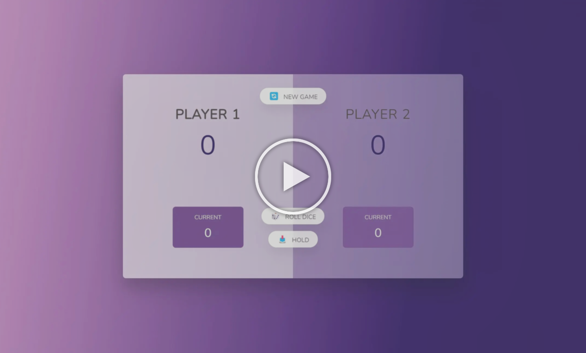

# Clash of Dices

**'Clash of Dices' is a two-player dice game where players take turns rolling dice and accumulating points. The objective is to be the first player to reach a target score, typically 100 points.**

<!DOCTYPE html>
<html lang="en">
  <body>
      
  </body>
</html>

**index.html**

This is the HTML file that structures the web page for the 'Clash of Dices.'

**style.css**

This file contains the CSS styles for the "Clash of Dices." Here's a breakdown of the different sections:

    Imports and Resets
        - It brings in the "Nunito" font from Google Fonts.
        - Resets the default browser styles for margin, padding and box sizing.
        - Establishes the base font size. Enables border box sizing.

    Variables and Animations
        - Sets up CSS variables for colors and a gradient angle.
        - Adds an animation to rotate the background gradient.

    Body Styles
        - Defines the family, height, color and background gradient.
        - Applies the rotation animation to the background.
        - Centers the content both vertically and horizontally.

    Layout
        - Outlines how to structure the content area and player sections.
        - Gives style to the player section with a transparent background

    Element Styles
        - Styles for player names, scores, current scores, and buttons.
        - Implements transitions and hover effects for elements.

    Absolute Positioning
        - Positions elements, like dice images, buttons and winner styles using positioning. 

**script.js**

This file contains the JavaScript code that powers the "Clash of Dices." Here's a breakdown of the different sections:

    Variable Declarations
        - Declares variables for storing the current score, final scores, active player, and game state.
        - Selects DOM elements for scores, players, dice, and buttons.

    Initialization Function
        - Resets the game state, scores, and active player.
        - Initializes the player scores to 0 and hides the dice.

    Switching Player Function
        - Resets the current score to 0.
        - Switches the active player and updates the UI accordingly.

    Event Listeners:
        - Adds a click event listener to the "Roll Dice" button.
            > Generates a random number, between 1 and 6.
            > Current score is updated unless the number rolled is 1.
            > If a 1 is rolled it switches to the other player.
        - Adds a click event listener to the "Hold" button.
            > Current score is added to the score of the player.
            > Checks if the players final score reaches or exceeds 100 (the winning threshold).
            > If someone wins that player is announced as the winner. The game ends.
            > If no one wins yet it switches to the player.
        - Adds a click event listener to the "New Game" button.
            >  Triggers an initialization function to reset and start a game.

**The programming is well organized, follows best practices for keeping HTML, CSS and JavaScript separate, for clarity. In the JavaScript file strict mode is. DOM manipulation is used to keep the game running and providing interactive expxerience for players.**

**The most comfortable way to preview HTML files on GitHub is to go to 'https://htmlpreview.github.io/' and then enter URL of the HTML file to preview.**
